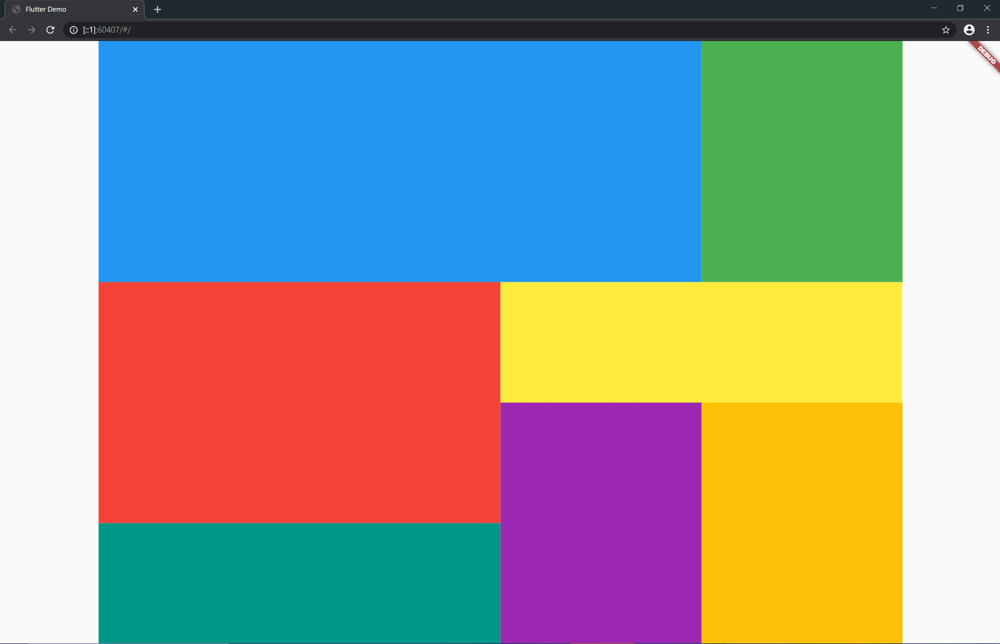

# expandedgrid

An unscrollable Grid View.



# Usage

First, determine column and row size.

Default size is column = row = 1.

```dart
ExpandedGrid(
  column: 4, 
  row: 5,
)
```

Second, pass ExpandedGridContent List to children.

If ExpandedGridContent specifies out of range, it is ignored.

Default position is (0,0).

```dart
ExpandedGrid(
  column: 4, row: 5,
  children: <ExpandedGridContent>[
    ExpandedGridContent(
      rowIndex: 0, columnIndex: 0,
      rowSpan: 2, columnSpan: 3,
      child: Container(color: Colors.blue,)
    ),
    //...
  ]
```
